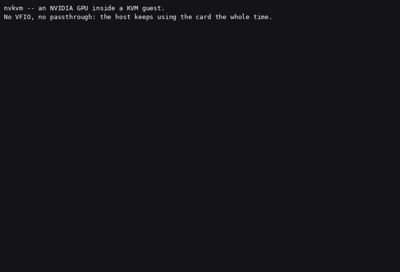

# nvkvm

Run CUDA, PyTorch and Vulkan inside a KVM guest — on the same GPU your host is
still using.



<sub>Real recording on an RTX 3050 Laptop GPU: cold boot to `nvidia-smi` inside
the guest, with the host still holding the card. Idle time is fast-forwarded;
nothing printed was cut. ([asciinema cast](docs/img/boot.cast) ·
[how it was made](tools/demo/README.md))</sub>

`nvkvm` gives a virtual machine real, driver-level access to an NVIDIA GPU
without handing the card over to it. The host keeps the GPU. The guest gets
`/dev/nvidia0` and friends, backed by a small kernel module that forwards the
NVIDIA Resource Manager ioctl surface over virtio to the host driver.

Unmodified NVIDIA userspace runs inside the guest. Not a CUDA shim, not an API
remoting layer, not a container: the guest's own `libcuda` talks to what it
believes is a real driver, and the work executes on real hardware.

From a user's perspective, this is what it buys you:

- give a VM GPU access **without PCIe passthrough**, so the host keeps the card
- run **several VMs against one GPU**, and the host desktop alongside them
- attach a guest to a GPU **in under a second** — no driver re-initialisation,
  no device reset, no `vfio-pci` rebind
- run **consumer GeForce hardware**, with no vGPU licence and no datacenter SKU
- keep a **real VM boundary** — the guest never receives the physical device,
  gets no MMIO window to it, and has no DMA path to host memory
- **bring your own guest image** — a stock NVIDIA driver, not a licensed
  vGPU guest driver bound to one vendor's cloud
- **keep your existing container workflow** — Docker with
  `nvidia-container-toolkit` works unmodified inside the guest, so
  `docker run --gpus all` behaves as it does on the host
- **pass several GPUs to one guest** — multiple devices are autodetected and
  independently usable, verified concurrently on two cards

It is fast because the guest is not in a hot path. Control calls are forwarded;
the work itself is not. A kernel launch reaches the GPU as a store to a mapped
doorbell page, so there is no per-operation cost to pay:

> **A 32-billion-parameter model served through vLLM runs at 0.99-1.00x of host
> speed inside the guest, and produces token-identical output at temperature 0.**
> Seventeen other workloads — PyTorch, ResNet-50, BERT, Vulkan compute — land
> between 0.95x and 1.00x. [See the numbers](#tested-applications).

That is **one** GPU. Tensor-parallel serving across several is correct but not
yet fast — see [multi-GPU serving](#multi-gpu-serving-correct-not-yet-fast).

## Where it's useful

- **A workstation you don't want to give up** — GPU work inside a VM while the
  host keeps the display and the same card.
- **One GPU, several VMs** — a homelab or shared dev box where every VM gets
  GPU access, with no card each and no `vfio-pci` rebind between starts.
- **Disposable environments** — CI runners or per-task VMs that come and go;
  attaching costs under a second and needs no device reset.
- **Kernel and driver work** — boot an experimental guest kernel without
  rebooting the host or losing the GPU.
- **Consumer GeForce** — cards that vGPU does not cover at all, with no licence.

Not yet for untrusted multi-tenant hosting — see below.

## What it is not

- **Not a hardened multi-tenant sandbox.** The guest/host boundary is not yet a
  security boundary you should rely on — read [`SECURITY.md`](SECURITY.md)
  before you decide where to run this. It also runs in **containers**, where
  Linux namespaces are usually blocked — the isolate falls back to UID separation,
  which is weaker; see [the isolate model](docs/internal/isolate-model.md). We
  audit it ourselves and publish what we find, fixed or not: the
  [pointer audit](docs/internal/audit-guest-pointers.md) (14 unenforced paths,
  5 since fixed) and the
  [boundary audit](docs/internal/audit-boundaries-2026-08-20.md) (19 findings
  across all three trust boundaries, 15 fixed, 4 named as open). The most
  exposed surface in the second was liveness, not memory safety: an
  unprivileged guest could hang the whole VMM without corrupting anything.
  **Do not put untrusted tenants behind it.**
- **Not a virtual monitor.** There is no scanout path. A GPU-accelerated desktop
  runs inside the guest and frames leave by *capture*, not by a virtual display.
  See [Known limitations](docs/internal/known-limitations.md).
- **Not vGPU.** No SR-IOV, no hardware partitioning, no MIG. Sharing is
  cooperative, at the driver interface.
- **Not a Windows guest solution.** Linux guests only.
- **Pinning host memory is slower than native**, and one registration is capped
  at 2 GiB. Stock vLLM starts and runs; see
  [known limitations](docs/internal/known-limitations.md#pinned-host-memory) for
  the numbers.

## Requirements

| | |
|---|---|
| Host | Linux with **working KVM** (see below), an NVIDIA GPU, and the proprietary/open NVIDIA driver installed |
| Guest | Linux, kernel 5.15 – 7.0 (built on every LTS in range; run-tested on Ubuntu 24.04, kernel 6.8) — see [guest kernels](docs/reference/guest-kernels.md) |
| GPU | Turing or newer — Pascal enumerates but `cuInit` fails, and the open kernel module will not probe it at all (see [Tested platforms](#tested-platforms)) |
| Size | ~16 GB RAM and 4 vCPUs free for the guest (the defaults), plus ~40 GB disk for the guest image and QEMU |
| Driver | See [supported drivers](docs/reference/supported-drivers.md) |
| Install | A [container image](#docker-start-here) or a [prebuilt tarball](#prebuilt-tarball-on-a-bare-host); [from source](#from-source-if-you-want-to-hack-on-it) QEMU 9.2 is built by the provided script |

**Check you can actually open `/dev/kvm` before anything else.** That is the
whole test — not CPU flags, which a container inherits from its host, so
`grep vmx /proc/cpuinfo` reads healthy inside one that has no `/dev/kvm`:

```bash
exec 3<>/dev/kvm && echo "KVM usable" && exec 3>&-
```

That opens the device rather than asking about it, which is the only test that
counts: `test -w` consults permission bits, and permission bits are not the
whole story — group membership does not take effect in a shell you were already
in when it was granted.

If it fails with permission denied, you are almost certainly not in the group
that owns the node (`crw-rw---- root kvm` on most distributions):

```bash
sudo usermod -aG kvm "$USER"    # then log out and back in, or: newgrp kvm
```

Containers are fine **provided the device is passed in** — the
[`docker-compose.yml`](docker-compose.yml) here does exactly that. What does not
work is a container without it, or a VM whose host has nested virtualisation
switched off.

Without `/dev/kvm`, QEMU silently falls back to software emulation (TCG): it
appears to work and is unusably slow, which is the most expensive way to find
out.

## Install

Three ways in, in the order most people should try them. The container is
first because it is the only one that does not make you wait for a QEMU build.

Everything below is published from a tag by
[`.github/workflows/release.yml`](.github/workflows/release.yml) on a
GitHub-hosted runner and carries a
[build-provenance attestation](#verifying-what-you-downloaded) — so "did this
come from this repository?" is a question you can answer rather than assume.

### Docker (start here)

```bash
docker run --rm -it --device /dev/kvm --gpus all \
    -e NVIDIA_DRIVER_CAPABILITIES=compute,utility,graphics,display,video \
    -p 127.0.0.1:2222:2222 -v nvkvm-guest:/opt/nvkvm-guest \
    ghcr.io/reindertpelsma/nvkvm-pv:v0.0.1-rc2
ssh -p 2222 ubuntu@127.0.0.1    # into the guest -- nvidia-smi already works
```

`NVIDIA_DRIVER_CAPABILITIES` is not optional decoration: `--gpus all` alone
gives the container `compute,utility`, and the guest then gets a compute-only
driver with no GL or Vulkan libraries — which does not fail, it silently falls
back to llvmpipe.

[`docker-compose.yml`](docker-compose.yml) is the same thing with those
capabilities, a tightened `cap_drop`/`cap_add` set, the shared folder and the
named volume already spelled out, and is the better starting point for anything
you intend to keep:

```bash
docker compose pull && docker compose up   # the published image
docker compose up --build                  # or build QEMU here instead
```

The guest comes up with the module loaded and the GPU present — no manual
staging step.

- **Requirements:** `/dev/kvm` and, for the GPU, the
  [NVIDIA container runtime](https://github.com/NVIDIA/nvidia-container-toolkit).
  Both are already in [`docker-compose.yml`](docker-compose.yml). No
  `--privileged`, no added capabilities.
- **Isolation is a different trade here, and arguably a better one.** Containers
  usually block unprivileged user namespaces, so the per-VM isolate falls back to
  UID separation — a weaker inner boundary. What sits behind it matters more.
  nvkvm's isolate sandboxes the **stub**; it does not sandbox the VMM, and QEMU
  runs on the host unconfined. **Eleven of the nineteen findings in our own
  boundary audit target the VMM**, so on a bare host that is where they land. In
  a container they land in the container, behind a boundary that is not our code
  and is scrutinised far more than ours. A minimal image with nothing useful
  readable by other UIDs strengthens it further. Neither arrangement makes nvkvm
  ready for untrusted tenants — see [`SECURITY.md`](SECURITY.md).
- **The driver userspace is mounted read-only, not copied in.** The container
  hands the guest the host's NVIDIA libraries over a read-only 9p share and the
  guest links against them, so `apt upgrade` inside the guest cannot replace a
  driver library — there is none in its filesystem to replace.
- **`./data` is shared with the guest** at `/data`, read-write, for moving work
  in and out.
- **The guest disk is a named volume**, so rebuilding the image does not
  re-download it, and the GPU comes back on every boot (a systemd unit rebuilds
  the module against the running kernel).
- **Sizing and image:** `VM_MEM`, `VM_SMP`, and `NVKVM_GUEST_IMAGE_URL` to bring
  your own cloud image — any cloud-init capable Linux that can build an
  out-of-tree module should work, though only the default Ubuntu 24.04 is tested.

Verified end to end on an RTX 3060: cold `docker compose up` to `nvidia-smi`
inside the guest, surviving a guest reboot and a guest `apt` install of a
conflicting NVIDIA package.

### Prebuilt tarball, on a bare host

The full sandbox rung, without building QEMU yourself. From the
[releases page](https://github.com/reindertpelsma/nvkvm-pv/releases):

```bash
# runtime dependencies -- the tarball ships QEMU, not what QEMU links against
sudo apt install -y libglib2.0-0t64 libpixman-1-0 libslirp0 \
                    qemu-utils genisoimage sshpass

tar xzf nvkvm-<version>-linux-x86_64.tar.gz && cd nvkvm-<version>
sudo cp -a qemu-nvkvm /opt/qemu-nvkvm
sudo install -Dm755 src/stub/nvkvm_stub /usr/lib/nvkvm/nvkvm_stub
```

Built on Ubuntu 24.04, so it needs **glibc 2.38 or newer** — on an older host
(Ubuntu 22.04 is glibc 2.35) use the container, which brings its own userspace.

```bash
bash scripts/setup_guest.sh         # fetches an Ubuntu 24.04 cloud image
```

x86-64 only, and the QEMU in it is headless (no GTK/SDL window — build from
source for that). It carries a glibc floor, since it is a real binary built on
Ubuntu 24.04; the exact number and the runtime package list are in `RELEASE.md`
inside the tarball.

**The guest kernel module is not in there and cannot be** — it is compiled
against *your* guest's kernel. That is why `src/guest/` ships with the tarball:
`scripts/run_test_vm.sh` exports the unpacked directory to the guest over 9p at
`/mnt/nvkvm`, and cloud-init builds the module there on first boot.

### From source, if you want to hack on it

```bash
git clone https://github.com/reindertpelsma/nvkvm-pv.git nvkvm && cd nvkvm
bash scripts/build_qemu.sh          # builds the isolate stub, then QEMU 9.2 with the nvkvm device
bash scripts/setup_guest.sh         # fetches an Ubuntu 24.04 cloud image and prepares a disk
```

Most of the wall clock is QEMU. The script is a convenience, not the
mechanism: everything it changes in upstream QEMU is five patch files in
[`patches/`](patches/) — 94 lines, applied with `git apply` — plus a copy of the
device sources into `hw/misc/`.
[`docs/howto/build.md`](docs/howto/build.md) lists the whole delta and walks the
same build by hand, command by command, if you would rather not run a script
over your QEMU tree. `--force` is what you want after editing anything under
`src/qemu/`; see [`CONTRIBUTING.md`](CONTRIBUTING.md) for the three traps in
this build.

### Staging the guest driver libraries

Needed for the tarball and source paths, not for the container — the container
assembles this itself on start-up from what the NVIDIA runtime injects.

The guest needs NVIDIA userspace libraries version-matched to your **host**
driver. Assemble the bundle and stage it:

```bash
V=$(nvidia-smi --query-gpu=driver_version --format=csv,noheader | head -1)
bash scripts/make_host_bundle.sh    # collects host-libs-$V/ from the installed driver
```

Inside the guest, `scripts/stage_guest_libs.sh` puts them in place — see
[First result](#first-result) below. Guest setup is three things installed, not
two: that script also writes `/etc/X11/xorg.conf` from
[`data/xorg/nvkvm-xorg.conf`](data/xorg/nvkvm-xorg.conf), which is what makes a
stock distro's own Xorg session come up on the nvkvm head. It rewrites the
`BusID` to the address nvkvm's device actually has in your guest, it will not
overwrite an `/etc/X11/xorg.conf` you wrote yourself, and `NVKVM_STAGE_XORG=0`
tells it to leave X alone entirely
([detail](docs/howto/run.md#the-guests-own-xorg-session-a-stock-distro-desktop)).

### Verifying what you downloaded

The release workflow signs a statement about each artifact — which repository
built it, from which commit, in which workflow run — and
[`gh`](https://cli.github.com/) checks it against the artifact in your hand:

```bash
# the image, resolved straight from the registry
gh attestation verify oci://ghcr.io/reindertpelsma/nvkvm-pv:v0.0.1-rc2 \
    --repo reindertpelsma/nvkvm-pv

# the tarball, on disk
gh attestation verify nvkvm-<version>-linux-x86_64.tar.gz \
    --repo reindertpelsma/nvkvm-pv
```

Add `--signer-workflow reindertpelsma/nvkvm-pv/.github/workflows/release.yml`
to pin *which* workflow, not just which repository, was allowed to produce it.
That is the stronger check and it is the one to use if you are scripting this.

`--repo` is the point of the exercise: without it, `verify` will accept an
attestation from any repository, which makes it a signature check rather than a
provenance check. The `.sha256` file beside each download only proves the bytes
arrived intact.

## First result

```bash
bash scripts/run_test_vm.sh
```

Then, inside the guest (`ssh ubuntu@localhost -p 2222`, password `ubuntu`):

```bash
sudo bash /mnt/nvkvm/scripts/stage_guest_libs.sh
nvidia-smi
```

```
+-----------------------------------------------------------------------------------------+
| NVIDIA-SMI 575.51.03              Driver Version: 575.51.03      CUDA Version: 12.9     |
|   0  NVIDIA GeForce RTX 3060        Off |   00000000:00:07.0                            |
|  0%   44C    P8              6W /  170W |       1MiB /  12288MiB |      0%      Default |
+-----------------------------------------------------------------------------------------+
```

That is a guest enumerating a GPU the host has not given up.

Then run the suite the tables on this page are quoting, still inside the guest:

```bash
bash /mnt/nvkvm/tests/validate.sh
```

```
 TOTAL 28   PASS 28   FAIL 0   SKIP 0

 VERDICT: PASS (all 28 checks passed)
```

It exits 0 on a full pass, 1 on a failure and 2 if anything was skipped, so it
is usable in a script. Every `28/28` below is this command on that hardware.

## How it fits together

```
  GUEST                                        HOST
  ─────────────────────────────────────        ──────────────────────────────
  CUDA / PyTorch / Vulkan / OpenGL
    │  ioctl(/dev/nvidia*)
    ▼
  nvkvm-guest.ko                               QEMU: virtio-nvgpu device
    │  sanitise: zero guest VAs,                 │  validate against allowlist
    │  stage params in the aux slot              │  translate handles + fds
    │  virtio                                    ▼
    └──────────────────────────────────────►  per-process isolate  ──► NVIDIA driver ──► GPU
                                                (own RM client, own address space)
```

Three properties fall out of that shape:

**The guest never gets the device.** No BAR is mapped to it, no MMIO window is
handed over, and there is no DMA path from the guest to host memory. Compare
PCIe passthrough, where the GPU retains DMA access to host RAM and the isolation
boundary is weaker than the VM boundary suggests.

**Guest pointers are not meant to cross, and the host is what enforces it.** The
guest sanitiser zeroes pointer-sized fields carrying a guest VA, but that runs in
the guest and is therefore not a control — a malicious guest simply skips it. The
host boundary overwrites those fields itself. Enforcement today is per-ioctl and
hand-written rather than categorical, and is **not yet complete**: we audited it
and published what we found, open items included, in
[the pointer audit](docs/internal/audit-guest-pointers.md).

**In steady state there is no forwarded call at all.** Control operations cross
the boundary; work does not. A kernel launch reaches the GPU as a write-combining
store to a mapped BAR doorbell page — there is no doorbell interception anywhere
in this codebase. The project measured control-RTT at only 1–2% of per-token LLM
decode time, which is why the numbers below are ratios near 1.00 rather than a
fraction of host speed.

Full detail: [`ARCHITECTURE.md`](ARCHITECTURE.md).

## Known issues

- **NVIDIA's own X driver — the DDX — cannot be used inside the guest.** It
  reaches the GPU fine, then asks NVKMS about the **host's** physical displays:
  a question nvkvm will not forward, and could not answer honestly if it did.
  This costs you something only if you specifically need that driver — chiefly
  `nvidia-settings`, and the professional-application features that depend on
  it. Ordinary desktops are unaffected: a stock distro's own Xorg session comes
  up on the nvkvm head, and GL, Vulkan and CUDA are accelerated on all of them
  ([guest setup](docs/howto/run.md#the-guests-own-xorg-session-a-stock-distro-desktop),
  [mechanism and measurements](docs/internal/mint-guest-desktop.md)).
- **One rare crash is unexplained.** A GL client once took a guest down within a
  minute. It has not reproduced since — through a five-minute soak at 190,013
  frames and a full interactive desktop session — but several unrelated things
  changed in between, so treat it as open rather than fixed
  ([detail](docs/internal/known-limitations.md)).
- **`28/28` is not proof that your workload is correct.** The test suite covers
  bring-up, CUDA, Vulkan compute and offscreen GL. It does not cover everything,
  and a real correctness bug has passed it before. Check your own results
  against a host run ([what that bug was](docs/reference/correctness.md)).
- **Multi-GPU tensor-parallel serving is correct but slow** — 0.12–0.37x of
  host. Part of that is a confirmed bug (NCCL's shared-memory transport fails in
  the guest, so its fastest path is unreachable); the rest shows up even with
  identical NCCL settings on both sides and is **not yet explained**. Single-GPU
  serving is at parity
  ([numbers](#multi-gpu-serving-correct-not-yet-fast)).
- **Frameworks that pin large host buffers pay a penalty.** Registering pinned
  memory is slower than native and a single registration is capped at 2 GiB —
  noticeable in data loaders and serving stacks that pin aggressively. Stock
  vLLM starts and runs
  ([numbers](docs/internal/known-limitations.md#pinned-host-memory)).

## Tested applications

An independent third-party benchmark first, because it is the easiest to check:
**Geekbench 7 GPU (OpenCL) scores 99.9% of bare metal** — 48335 in the guest vs
48395 on the host, with all eleven workloads between 98.4% and 101.2%, on one
RTX 3050 Laptop GPU and one driver. Bare metal here is literal: the host side is
a physical ASUS TUF F17 laptop, not another VM
([side by side](https://browser.geekbench.com/v7/gpu/compare/81189?baseline=79862)).
Both runs are public; neither is ours to edit.

The rest is guest vs host, one statically-linked binary run on both sides, RTX
3060, host driver 575.51.03, strictly serial on one GPU.

| workload | host | guest | ratio |
|---|---|---|---|
| memory bandwidth (triad) | 336.2 | 336.3 GB/s | 1.00x |
| PyTorch matmul fp16 (tensor cores) | 26.03 | 26.03 TFLOP/s | 1.00x |
| ResNet-50 training step | 199.5 | 199.6 img/s | 1.00x |
| BERT encoder | 277.6 | 277.3 seq/s | 1.00x |
| Vulkan compute (vkpeak) | 8947.2 | 8975.3 GFLOP/s | 1.00x |
| OpenGL offscreen (EGL) | 1.8 | 1.8 Mtri/s | 1.00x |
| reduction bandwidth | 122.0 | 119.7 GB/s | 0.98x |
| Mandelbrot | 2.90e6 | 2.76e6 | 0.95x |

Eleven more — N-body, Black-Scholes, SHA-256, 2D convolution, ResNet-50
inference and AMP, ViT-B/16, PyTorch fp32 — all land at 1.00x. Full table and
method: [`tests/perf/realapp_matrix.md`](tests/perf/realapp_matrix.md).

Where the guest is measurably slower it is latency-bound control paths, never
sustained compute or bandwidth.

### Desktop graphics

A full desktop runs on the GPU inside the guest and can be displayed and driven
in a window on the host — including the stock Linux Mint Cinnamon desktop
([how](docs/howto/run.md#running-the-guest-desktop-in-a-window)).

On an RTX 4070 the guest's display flips at 59.9 Hz and **every one of those
frames reaches the host window: 60.0 swaps/s, zero dropped**, holding with a
browser rendering real pages and eight concurrent GPU clients. Measured with
per-frame counters over 60 consecutive one-second samples, every one of which
was exactly 60 frames. The pipeline is limited by display refresh, not by
forwarding overhead.

Graphics is the one area below parity, though far less than an earlier note
here claimed. Re-measured on an RTX 3060 with one `glmark2` binary,
sha256-identical on both sides: the full suite off-screen runs at **0.73x of
host**, and **0.89x** with `clocksource=tsc` in the guest. The GPU itself is at
parity — GL fill rate is 1.000x and draw-call submission is slightly *faster*
in the guest.

The remaining cost is not the present path. It is a cold first scene — the
guest's first scene in a process runs ~0.37x and every one after it 0.88-0.93x,
so a single-scene run measures the cold path and nothing else — plus clock
reads leaving the vDSO under `kvm-clock`, which a benchmark that times every
frame pays for directly. [Full decomposition and what was ruled
out](tests/perf/results/glmark2_2026-08-21/RESULTS.md).

### Containers

Docker with `nvidia-container-toolkit` works inside the guest with no special
handling — standard install, `docker run --gpus all`, and the GPU appears:

```
$ docker run --rm --gpus all nvidia/cuda:12.9.0-base nvidia-smi
NVIDIA-SMI 575.51.03   Driver Version: 575.51.03   CUDA Version: 12.9
0  NVIDIA GeForce RTX 3070   Off   00000000:00:07.0
```

Process enumeration is namespace-correct too — `nvidia-smi` inside a container
sees only that container's GPU processes, never a host PID. See
[device nodes](docs/reference/device-nodes.md).

### LLM serving

vLLM 0.11.0 serving **Qwen2.5-32B-Instruct-AWQ** (32.5B params, 19.34 GB) on an
RTX 6000 Ada, driver 575.51.03. Same venv on both sides, byte-identity proven by
sha256 over every `.py`/`.so`.

| | host | guest | ratio |
|---|---|---|---|
| prefill, 8245-token prompt | 1527.9 | 1532.9 tok/s | 1.00x |
| prefill, 16384-token context | 1374.0 | 1378.1 tok/s | 1.00x |
| decode, steady state | 41.68 | 41.08 tok/s | 0.99x |
| batch x32, output | 244.2 | 244.3 tok/s | 1.00x |
| batch x64, total | 1311.4 | 1311.9 tok/s | 1.00x |

At temperature 0 the guest produced **token-id identical** output to the host on
all three tasks (long-chain reasoning, C11 lock-free ring codegen, 8k-token
summarisation).

### Multi-GPU serving: correct, not yet fast

vLLM with `--tensor-parallel-size 6` on six RTX A4000s runs a 38 GB model that
does not fit on any one 16 GB card, and the guest's output is **byte-identical
to the host's** under matched settings. So it works and it is correct. It is
also slow:

| identical flags on both sides | host | guest | ratio |
|---|---|---|---|
| eager | 47.9 | 10.0 tok/s | 0.21x |
| CUDA graphs | 36.0 | 13.3 tok/s | 0.37x |
| host's best configuration | 115.7 | not reachable | 0.12x |

Note the first two rows have `NCCL_SHM_DISABLE=1` on **both** sides, so most of
this gap is not explained by the SHM bug below — with identical NCCL settings
the guest is still 3-5x slower, and **we do not yet know why**. The collectives
themselves are not it: matched, the guest matches or beats the host on both
bandwidth and latency, and an NCCL world=6 check passes on both sides.

What the third row shows is a separate, **confirmed guest-only bug**: NCCL's
shared-memory transport fails in `cuMemImportFromShareableHandle`, so
`NCCL_SHM_DISABLE=1` is required in the guest and the host's fastest
configuration is simply unreachable there. Fixing it closes the gap between rows
one and three; it does not by itself explain rows one and two.

Single-GPU serving is unaffected.

### Fine-tuning

A real Kaggle ARC-AGI notebook runs unmodified in the guest on an RTX 5090:
Unsloth LoRA fine-tuning **Qwen3** (128 steps, 13 GB allocated), then decode and
scoring inference at 14.7 GB — a full puzzle in 177 s. Training as well as
inference, multi-GB allocation churn between the two phases, and the Triton and
xformers paths, all through the forwarder.

Host parity: **—**, not measured yet for this workload; that is a gap in the
measurements, not a known shortfall.

## Tested platforms

Every row reached a real CUDA kernel launch through the forwarder, and `28/28`
means `tests/validate.sh` passed in full. Grouped by architecture here; the
[full matrix](docs/reference/tested-platforms.md) has every individual box,
driver and footnote.

| GPU | architecture | host drivers | `validate.sh` |
|---|---|---|---|
| GTX 1660 SUPER, GTX 1660 Ti, RTX 2080 Ti | Turing TU116 / TU102 | 535, 575 | 28/28 |
| RTX 3060, 3060 Ti, 3080, 3090, 3050 Laptop | Ampere GA10x | 545 → 610 | 28/28 |
| RTX 4060, 4070, 4070 Ti SUPER, 4090, RTX 4000 Ada | Ada AD10x | 575 → 595 | 28/28 |
| RTX 5070, RTX 5090 | **Blackwell** GB205 / GB202 | 580 | 28/28 |
| A100 80GB PCIe | **Ampere GA100** (datacenter) | 580 | 28/28 |
| H100 PCIe | **Hopper GH100** | 550 → 580, five versions | 28/28 |
| 2x RTX 4070 | Ada AD104 | 575 | 28/28, `cuda_device_count 2` |
| 4x RTX 5060 | Blackwell GB206 | 580 | 28/28, `cuda_device_count 4` |

Six architectures, and multiple GPUs in one guest work — four concurrent
isolates on the 4x box sustained 13.3 million verified kernel launches with all
four GPUs busy at once.

Several of those rows cost a bug fix to reach, and two of them looked like
NVIDIA's bugs until the same test was run on bare metal:
[what broke and how it was found](docs/reference/correctness.md).

Coverage is a function of what someone happened to rent, so it is uneven by
construction — reports from hardware not listed are genuinely wanted, and a
**failure** is worth more than a success. See [contributing](CONTRIBUTING.md).

## FAQ

**Is this vGPU or SR-IOV?**
No. There is no hardware partitioning and no vendor licence. nvkvm forwards the
driver interface; the GPU is shared cooperatively, the way two processes on one
machine share it.

**Will my GPU work?**
Turing (GTX 16xx / RTX 20xx) or newer. Six architectures are tested, from GTX
1660 to H100 — see [tested platforms](#tested-platforms). Pascal and older do
not work.

**Does the guest need a special driver?**
No. The guest runs stock NVIDIA userspace — its own `libcuda`, unmodified. What
it does need is a small kernel module, and userspace libraries matching your
**host** driver version, which `scripts/` stages for you.

**Can several VMs share one GPU?**
Yes, and the host keeps using it at the same time.

**What's the performance cost?**
Close to nothing for work that batches — a 32B model through vLLM runs at
0.99–1.00x of host speed. Single-stream, launch-bound workloads pay more; see
[reading the parity numbers](docs/reference/parity.md).

**Is it safe to run untrusted guests?**
Not yet. Read [`SECURITY.md`](SECURITY.md) before deciding where to run this.

[More questions](docs/faq.md) — driver version coverage, guest distros,
container support, llvmpipe, bit-identical results.

## Documentation

| | |
|---|---|
| [`ARCHITECTURE.md`](ARCHITECTURE.md) | The request path end to end, and how the hard problems are solved |
| [`docs/howto/`](docs/howto/) | Building, running, staging guest libraries, adding a driver version |
| [`docs/reference/`](docs/reference/) | ABI profiles, allowlists, virtio protocol, device nodes |
| [FAQ](docs/faq.md) | The full set — driver coverage, guest distros, containers, llvmpipe |
| [Correctness](docs/reference/correctness.md) | What is known to be wrong, how far it is traced, how to reproduce it |
| [Reading the parity numbers](docs/reference/parity.md) | What the host/guest ratios do and do not establish |
| [Tested platforms, full matrix](docs/reference/tested-platforms.md) | Every box, driver and footnote |
| [Guest kernels](docs/reference/guest-kernels.md) | Which guest kernels the module builds on, measured, and why the range is narrow |
| [`.github/workflows/`](.github/workflows/) | What CI checks on every push, how a release is built and attested, and why each job exists |
| [`docs/internal/`](docs/internal/) | Design rationale, forwarding model, isolate model, known limitations |
| [`SECURITY.md`](SECURITY.md) | Threat model, what is known broken, how to report a vulnerability |
| [`CONTRIBUTING.md`](CONTRIBUTING.md) | What is most useful to send, and three traps in the build |
| [Security audits](docs/internal/audit-boundaries-2026-08-20.md) | Both audits, findings and status — locations, not techniques |

## Status

Experimental — a research artifact, not a supported product. It runs real
workloads at host parity on six GPU architectures (Turing, Ampere, Ada,
Blackwell, and the GA100 and Hopper datacenter parts), including multiple GPUs
in one guest.

The largest open item is that NVIDIA's own X driver cannot run in a guest — it
wants the host's display engine — so a guest's Xorg session composites on the
CPU and offloads rendering to the GPU rather than scanning out from it.
Everything else is tracked in
[known limitations](docs/internal/known-limitations.md).

Issues and measurements from other hardware are welcome — particularly boots on
driver branches this repository has not exercised. Coverage here is a function
of what someone happened to rent, so your card is probably one we do not have:
see [contributing](CONTRIBUTING.md), and note that a **failure** report is worth
more to us than a success.

## Credits

`nvkvm` derives substantially from **gVisor's `nvproxy`** (Apache-2.0) for the
ioctl allowlist model, object tracking and frontend handling, and from
**NVIDIA's open-gpu-kernel-modules** for ABI struct definitions. Per-file
attribution is in [`CREDITS`](CREDITS).

Two other public non-vendor efforts at driver-level NVIDIA GPU virtualization
are worth reading: [`nestrilabs/virtio-nvgpu`](https://github.com/nestrilabs/virtio-nvgpu)
(virtio transport, libkrun, KVM memslot mmap) and
[`straylight-software/isospin-microvm`](https://github.com/straylight-software/isospin-microvm)
(vsock transport, Firecracker workers borrowing a GPU-owning VM).

## Licence

Apache-2.0, except the guest kernel module (`src/guest/`), which is GPL-2.0 as
required for kernel symbol access. See [`LICENSE`](LICENSE).
