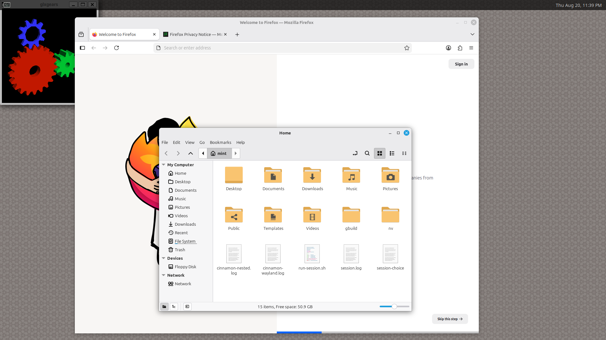

# A Linux Mint desktop on the nvkvm head

Status: **an accelerated Mint desktop runs unattended via weston.**  Stock
Mint's *own* Xorg session does not, and this file records exactly why — with
the host checked as a control in every case.

The headline goal is stock Mint on its native Xorg session.  weston is not that
goal; it is a working control that proves the nvkvm head, the DRM node and the
NVIDIA EGL/GBM stack are all healthy, which is what makes the Xorg findings
below trustworthy rather than "something in the guest is broken".

## What works (measured on the RTX 4070 box, host driver 595.84)

Guest: Linux Mint 22.3, kernel 6.14.0-37-generic, installed by
`scripts/setup_mint_guest.sh`.

The guest **boots unattended to a composited desktop on the nvkvm KMS head**,
and it is genuinely on the GPU.  After a cold `systemctl reboot` of the guest,
with nothing typed:

- `nvkvm-guest.service` active, `nvkvm_guest` loaded, all 3 9p mounts present
- `/dev/dri/card0` and `renderD128` present as `root:video` / `root:render` 0660
- `weston --backend=drm --xwayland` running on tty1, and from its log:

      using /dev/dri/card0
      Using rendering device: /dev/dri/renderD128
      EGL vendor: NVIDIA
      GL version: OpenGL ES 3.2 NVIDIA 595.84
      GL renderer: NVIDIA GeForce RTX 4070/PCIe/SSE2

Clients are accelerated on both display protocols — checked separately rather
than assumed:

| client path | renderer |
|---|---|
| Xwayland (`glxinfo -B`, `DISPLAY=:0`) | `NVIDIA GeForce RTX 4070/PCIe/SSE2`, GL 4.6.0 NVIDIA 595.84 |
| native Wayland (`eglinfo -B`, Wayland platform) | `NVIDIA GeForce RTX 4070/PCIe/SSE2`, GL 4.6.0 NVIDIA 595.84 |
| `glxgears -info` | `GL_RENDERER = NVIDIA GeForce RTX 4070/PCIe/SSE2`, **60.0 FPS** vsync-locked |

Firefox, Nemo and glxgears were run together and all three rendered (see the
screenshot).  No llvmpipe anywhere on any of these paths.

## Why not Cinnamon's own session — the cursor-plane gap

Cinnamon's Wayland session gets *much* further than Xorg does.  muffin brings
up KMS on the nvkvm head correctly, and then dies:

    muffin-WARNING: Failed to set hardware cursor
                    (drmModeSetCursor failed: No such device or address),
                    using OpenGL from now on
    cinnamon-session-binary: WARNING: Application 'cinnamon-wayland.desktop'
                    killed by signal 11

The backtrace from the core is unambiguous:

    #0  disable_hw_cursor_for_crtc        (libmuffin.so.0)
    #1  meta_cursor_renderer_update_cursor
    #2  meta_cursor_renderer_set_position
    #3  meta_backend_real_post_init
    #4  meta_backend_native_post_init
    #5  meta_backend_post_init
    #6  meta_init_backend
    #7  main                              (cinnamon)

So there are **two separate defects stacked**, and they should not be conflated:

1. **nvkvm gap (ours).**  `drmModeSetCursor` returns `-ENXIO` because nvkvm
   exposes no cursor plane.  `drm_simple_display_pipe_init()` creates exactly
   one plane — the primary — and never sets `crtc->cursor`, and the legacy
   cursor ioctl returns `-ENXIO` when a CRTC has neither `cursor_set`/
   `cursor_set2` funcs nor a cursor plane.

   **This is not something the host does too** — checked directly, because that
   is the assumption that has been wrong repeatedly on this project:

   | | planes | Overlay | Primary | Cursor |
   |---|---|---|---|---|
   | host `nvidia-drm` (`modetest -M nvidia-drm -p`) | 12 | 4 | 4 | **4** |
   | guest nvkvm | **1** | 0 | 1 | **0** |

2. **muffin bug (theirs).**  Failing that ioctl is legal — muffin even says it
   will fall back to an OpenGL cursor — but it then SEGVs *inside the fallback*.
   A driver without a cursor plane is a supported configuration upstream, so
   muffin crashing here is its own bug, not a consequence of ours.

Note the shape of the fix matters.  Registering a *no-op* cursor plane just to
make the ioctl succeed would stop the crash and leave the user with **no visible
pointer at all**, because muffin would then believe the hardware cursor works
and stop compositing one.  A correct fix has to carry the cursor through to the
host — the guest plane's content forwarded to QEMU's console cursor
(`dpy_cursor_define` / `dpy_mouse_set`) — which means guest KMS + protocol +
QEMU-side work, not a one-liner.  Until then weston is the supported path:
it composites its own cursor and needs no cursor plane.

Also observed, not yet chased: `cinnamon --wayland --nested` inside weston
starts fully (applets load, no GL errors in its log) but its window renders
solid black.

## The native-Xorg glamor failure (unchanged, still open)

    (EE) modeset(0): Failed to create pixmap
    (EE) Fatal server error:
    (EE) failed to create screen resources

from `drmmode_set_pixmap_bo()` -> `glamor_egl_create_textured_pixmap_from_gbm_bo()`.
Reproduced; lightdm restart-loops on it ~22 times.

One datum narrows it: **EGL-over-GBM in the guest is genuinely NVIDIA**, not a
software fallback.  `eglinfo -B` reports `EGL vendor: NVIDIA` and
`NVIDIA GeForce RTX 4070/PCIe/SSE2` for both the GBM and surfaceless platforms.
So glamor is not failing because EGL fell back to software.  The untested next
measurement is whether `gbm_bo_get_fd()` / dmabuf export survives the round trip
through nvkvm.  **Not yet checked whether the host does the same thing** — that
must happen before calling this one an nvkvm bug.

`libEGL warning: egl: failed to create dri2 screen` appears before NVIDIA is
selected; that is Mesa failing and glvnd falling through, not nvkvm failing.
It is the same Mesa-first probe that produced the earlier
`AIGLX: Loaded and initialized nouveau` line.

## Traps worth not re-hitting

- **The infinite login loop.**  `/usr/bin/cinnamon-session` is a shell wrapper
  that, for a wayland session, re-execs through a LOGIN shell
  (`exec bash -c "exec -l '$SHELL' -c '$0 -l $*'"`) to inherit the login
  environment.  If `~/.bash_profile` is what launches the session, that login
  shell re-reads it and starts the session again — an infinite exec chain that
  spins at 100% CPU, spawns no compositor, and prints **nothing at all**.  The
  0-byte session log is the whole symptom.  `setup_mint_guest.sh` guards it with
  `NVKVM_SESSION_LAUNCHED`, which survives because exec preserves the
  environment.
- **DRM node permissions after a manual insmod** are `root:root` 0600 with no
  `by-path` links, because the nodes miss the boot uevent flow.  It is not a
  missing udev rule; `udevadm trigger --subsystem-match=drm` fixes it.
- **The guest module will not build from a copy of `src/guest/` alone** — it
  includes `../../src/common/nvkvm_proto.h`.  Copy the whole `src/` tree, or
  build in place from `/mnt/nvkvm`.
- lightdm must stay disabled; enabled, it restart-loops forever on the glamor
  bug and generates continuous disk I/O.

## Why stock Mint's Xorg session cannot use modesetting+glamor

Settled, with the host as control — see `tests/repro/gbm_egl_import.c`.

dma-buf export *does* survive the round trip through nvkvm.  Host and guest,
card node and render node, all four identical: same modifier
`0x300000000606014`, same stride, `gbm_bo_get_fd()` works, `EGL_LINUX_DMA_BUF_EXT`
import works, and the imported bo is a complete FBO that renders and reads back.
There is no forwarding defect.

What fails is one call, and it fails on bare metal too:

    eglCreateImageKHR(dpy, EGL_NO_CONTEXT, EGL_NATIVE_PIXMAP_KHR, bo, NULL)
        -> EGL_BAD_PARAMETER (0x300C)    host AND guest, every modifier

Every modifier: block-linear, the render-only variant, and plain `LINEAR`.  So
there is no modifier nvkvm could advertise that would make it succeed.

That call is verbatim what glamor does — read from xorg-server 21.1.12 source
in the guest, not recalled:
`glamor/glamor_egl.c:glamor_egl_create_textured_pixmap_from_gbm_bo()` makes it
and returns FALSE on failure;
`hw/xfree86/drivers/modesetting/drmmode_display.c:drmmode_set_pixmap_bo()`
turns that into `"Failed to create pixmap"`, which becomes the fatal
`"failed to create screen resources"`.

**Conclusion: modesetting+glamor is a dead end on the proprietary NVIDIA driver,
in a guest and on real hardware alike.**  It is not the path a stock Mint
install uses on an NVIDIA card either.

## The NVIDIA DDX — how far it gets, and the exact gap

The path a real NVIDIA box uses is the NVIDIA DDX.  Neither `nvidia_drv.so` nor
`libglxserver_nvidia.so` was ever staged into the guest; both exist on the host
under `/usr/lib/x86_64-linux-gnu/nvidia/xorg/`.  Staged by hand, with the host's
own `/usr/share/X11/xorg.conf.d/10-nvidia.conf`, Xorg gets a long way:

    (**) OutputClass "nvidia" ModulePath extended to ".../nvidia/xorg,..."
    (II) Applying OutputClass "nvidia" to /dev/dri/card0
    	loading driver: nvidia
    (II) Loading .../nvidia/xorg/nvidia_drv.so
    (II) NVIDIA dlloader X Driver  595.84
    (II) Loading sub module "glxserver_nvidia"
    (II) NVIDIA GLX Module  595.84
    (II) NVIDIA: The X server supports PRIME Render Offload.
    (EE) NVIDIA(GPU-0): Failed to initialize the NVIDIA graphics device!
    (EE) NVIDIA(0): Failing initialization of X screen

Note the OutputClass matches: nvkvm's guest DRM driver reports its name as
`nvidia-drm`, so `MatchDriver "nvidia-drm"` selects the NVIDIA DDX with no
hand-written `xorg.conf` at all.  The DDX and the GLX server module both load.

**The gap is PCI BARs.**  Under strace the DDX never opens `/dev/nvidia0` or
`/dev/nvidiactl` — it fails before that, after reading
`/sys/bus/pci/devices/0000:00:07.0/{vendor,device,class,revision,config,resource,boot_vga}`.
And that device has no BARs:

| | BAR0 (regs) | BAR1 (FB aperture) | BAR3 | I/O |
|---|---|---|---|---|
| host `0000:01:00.0` | `0xfb000000-0xfbffffff` (16 MB) | `0xb0000000-0xbfffffff` (256 MB) | 32 MB | `0xf000-0xf07f` |
| guest `0000:00:07.0` | — | — | — | — |

Every BAR reads back zero; the only non-zero line is the legacy VGA range.
That is by design — `nvkvm-gpu` is the identity-only device
("No BARs/DMA; all GPU I/O still flows through virtio-nvgpu forwarding"), there
purely to give the render node an NVIDIA-vendor PCI parent.

So the NVIDIA DDX wants a real register aperture to drive a display engine, and
nvkvm deliberately does not present one.  **This is a genuine nvkvm gap and the
honest blocker for stock-Mint-on-native-Xorg** — but note it is not a small one:
even with BARs faked, the DDX drives outputs through nvidia-modeset on the real
GPU, which is the *host's* display engine and physical connectors, not nvkvm's
virtual head.  Making this work is a design question (what should a guest DDX
scan out to?), not a missing-forward.

## `-vga none` is NOT required

The old note in `known-limitations.md` gave two reasons; both are *selection*
problems, and both are fixed by naming things rather than deleting the boot
console.  Verified by booting with QEMU's default VGA present:

- **Guest-side.** With a VGA present the guest gets two DRM devices —
  `card0 -> bochs-drm`, `card1 -> nvidia`.  A compositor that takes `card0`
  lands on bochs-drm and **silently renders with llvmpipe**: observed exactly
  that, `EGL vendor: Mesa Project`, `GL renderer: llvmpipe`.  This is the
  silent-software-fallback failure mode, and it is the real hazard the old note
  under-described.  Fix: select the DRM node by **driver**, never by index —
  `run-session.sh` walks `/sys/class/drm/card[0-9]*/device/driver` for `nvidia`
  and passes `weston --drm-device=`.  With that in place and the VGA still
  present: `using /dev/dri/card1`, `EGL vendor: NVIDIA`,
  `GL renderer: NVIDIA GeForce RTX 4070/PCIe/SSE2`.
- **Host-side.** `screendump` takes a device argument, so the console can be
  named instead of being the only one — hence `id=nvkvm0` in `run_test_vm.sh`.

Keeping the VGA also fixes the GRUB `gfxterm` stall: GRUB and the early kernel
now have a device to draw on, and `/dev/fb0` + `fbcon` exist in the guest.

### screendump by device id — a QEMU abort we can hit

`screendump <file> nvkvm0` **kills QEMU**:

    Unexpected error in object_property_find_err() at ../qom/object.c:1349:
    Property 'qemu-fixed-text-console.device' not found

`ui/console.c:qemu_console_lookup_by_device()` walks *every* console and calls
`object_property_get_link(OBJECT(con), "device", &error_abort)`.  Only graphic
consoles have a `device` link; `graphic_console_init()` sets it, text consoles
never have it.  So the walk aborts the moment it steps over a text console
before reaching the one asked for.

Isolated, minimal repro (no disk, no guest):

    qemu-system-x86_64 -m 256 -device VGA,id=vga0 \
        -device virtio-nvgpu-pci-non-transitional,id=nvkvm0 \
        -display none -monitor unix:/tmp/m.sock,server,nowait -S
    screendump /tmp/a.ppm vga0     # works  -- VGA console is found first
    screendump /tmp/b.ppm nvkvm0   # ABORTS -- walk reaches a text console

`vga0` survives only because its console is first in the list; the bug is
order-dependent, not VGA-specific.  It is a QEMU robustness bug (an
`&error_abort` on a property that legitimately does not exist for text
consoles), which nvkvm's console reaches because it is registered after one.
The fix belongs in that lookup — skip consoles that are not graphic consoles —
and it needs a QEMU rebuild plus a full `validate.sh` re-run, so it is written
down here rather than half-done.
