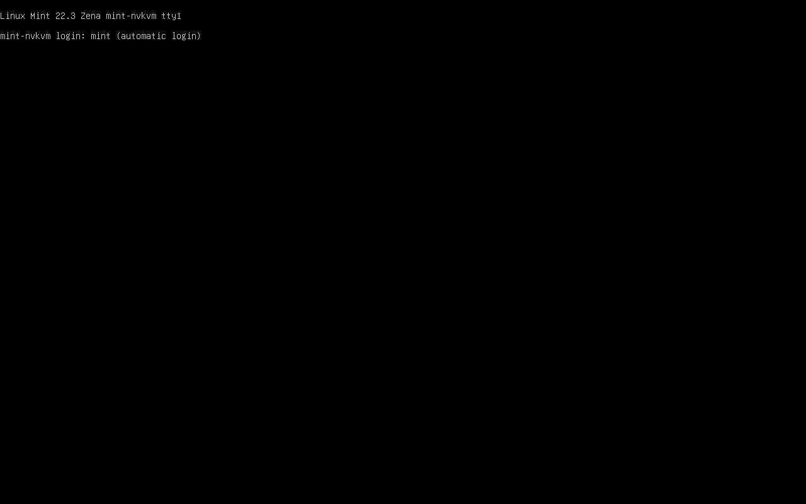
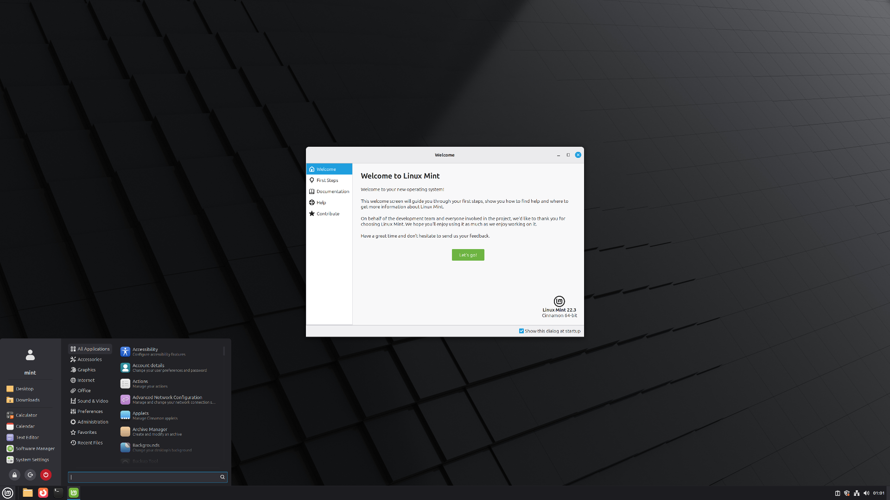
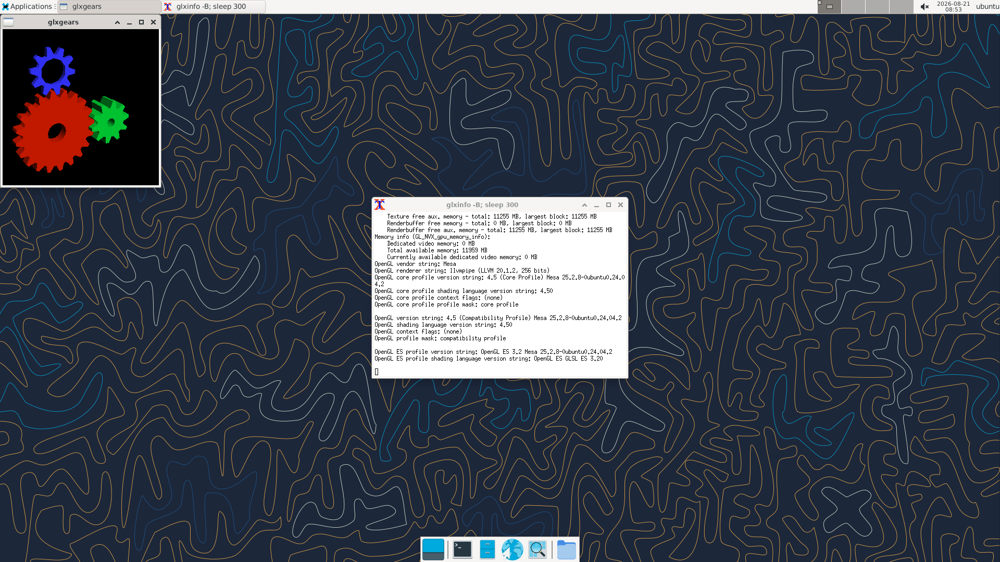

# A Linux Mint desktop on the nvkvm head

Status: **the real Mint Cinnamon desktop runs, accelerated, unattended.**
Cinnamon's own X11 session — panel, menu, wallpaper, the lot — inside a rootful
Xwayland hosted by weston on the nvkvm KMS head.  See "The Mint desktop" below.

A stock distro **does** now boot into its own Xorg session on the nvkvm head —
`modesetting` with `Option "AccelMethod" "none"`, GL clients accelerated on
NVIDIA through render offload (`data/xorg/nvkvm-xorg.conf`).  What still does
not work is the **NVIDIA DDX**, and as of 2026-08-21 we know exactly why and
exactly why it is not a one-line fix: see
["RESOLVED (2026-08-21)"](#resolved-2026-08-21-the-ddx-stops-on-one-denied-nvkms-command)
below.  This file records the whole trail, with the host checked as a control in
every case.

### A correction, because the earlier phrasing here was wrong

Earlier revisions of this file said things that read as "Mint's X11 is broken".
That is not true and it misled people, including the maintainer.  Stock Mint on
a real NVIDIA GPU obviously works — millions of people run it.  What it uses
there is the **NVIDIA DDX**, which is exactly the path a guest cannot provide.
The accurate statement is narrower:

> The one Xorg path reachable from a virtual KMS head — `modesetting` + glamor —
> is the one NVIDIA's proprietary EGL does not support.  On nouveau, or on any
> Mesa driver, that same call works fine.

So this is not "Mint fails", it is "the intersection of *virtual KMS head* and
*NVIDIA proprietary EGL* has no Xorg driver in it".

## What works (measured on the RTX 4070 box, host driver 595.84)

Guest: Linux Mint 22.3, kernel 6.14.0-37-generic, installed by
`scripts/setup_mint_guest.sh`.

The guest **boots unattended to a composited desktop on the nvkvm KMS head**,
and it is genuinely on the GPU.  After a cold `systemctl reboot` of the guest,
with nothing typed:

- `nvkvm-guest.service` active, `nvkvm_guest` loaded, all 3 9p mounts present
- `/dev/dri/card0` and `renderD128` present as `root:video` / `root:render` 0660
- `weston --backend=drm --xwayland` running on tty1, and from its log:

      using /dev/dri/card0
      Using rendering device: /dev/dri/renderD128
      EGL vendor: NVIDIA
      GL version: OpenGL ES 3.2 NVIDIA 595.84
      GL renderer: NVIDIA GeForce RTX 4070/PCIe/SSE2

Clients are accelerated on both display protocols — checked separately rather
than assumed:

| client path | renderer |
|---|---|
| Xwayland (`glxinfo -B`, `DISPLAY=:0`) | `NVIDIA GeForce RTX 4070/PCIe/SSE2`, GL 4.6.0 NVIDIA 595.84 |
| native Wayland (`eglinfo -B`, Wayland platform) | `NVIDIA GeForce RTX 4070/PCIe/SSE2`, GL 4.6.0 NVIDIA 595.84 |
| `glxgears -info` | `GL_RENDERER = NVIDIA GeForce RTX 4070/PCIe/SSE2`, **60.0 FPS** vsync-locked |

Firefox, Nemo and glxgears were run together and all three rendered (see the
screenshot).  No llvmpipe anywhere on any of these paths.

## Why not Cinnamon's own session — the cursor-plane gap

Cinnamon's Wayland session gets *much* further than Xorg does.  muffin brings
up KMS on the nvkvm head correctly, and then dies:

    muffin-WARNING: Failed to set hardware cursor
                    (drmModeSetCursor failed: No such device or address),
                    using OpenGL from now on
    cinnamon-session-binary: WARNING: Application 'cinnamon-wayland.desktop'
                    killed by signal 11

The backtrace from the core is unambiguous:

    #0  disable_hw_cursor_for_crtc        (libmuffin.so.0)
    #1  meta_cursor_renderer_update_cursor
    #2  meta_cursor_renderer_set_position
    #3  meta_backend_real_post_init
    #4  meta_backend_native_post_init
    #5  meta_backend_post_init
    #6  meta_init_backend
    #7  main                              (cinnamon)

So there are **two separate defects stacked**, and they should not be conflated:

1. **nvkvm gap (ours).**  `drmModeSetCursor` returns `-ENXIO` because nvkvm
   exposes no cursor plane.  `drm_simple_display_pipe_init()` creates exactly
   one plane — the primary — and never sets `crtc->cursor`, and the legacy
   cursor ioctl returns `-ENXIO` when a CRTC has neither `cursor_set`/
   `cursor_set2` funcs nor a cursor plane.

   **This is not something the host does too** — checked directly, because that
   is the assumption that has been wrong repeatedly on this project:

   | | planes | Overlay | Primary | Cursor |
   |---|---|---|---|---|
   | host `nvidia-drm` (`modetest -M nvidia-drm -p`) | 12 | 4 | 4 | **4** |
   | guest nvkvm | **1** | 0 | 1 | **0** |

2. **muffin bug (theirs).**  Failing that ioctl is legal — muffin even says it
   will fall back to an OpenGL cursor — but it then SEGVs *inside the fallback*.
   A driver without a cursor plane is a supported configuration upstream, so
   muffin crashing here is its own bug, not a consequence of ours.

Note the shape of the fix matters.  Registering a *no-op* cursor plane just to
make the ioctl succeed would stop the crash and leave the user with **no visible
pointer at all**, because muffin would then believe the hardware cursor works
and stop compositing one.  A correct fix has to carry the cursor through to the
host — the guest plane's content forwarded to QEMU's console cursor
(`dpy_cursor_define` / `dpy_mouse_set`) — which means guest KMS + protocol +
QEMU-side work, not a one-liner.  Until then weston is the supported path:
it composites its own cursor and needs no cursor plane.

Also observed, not yet chased: `cinnamon --wayland --nested` inside weston
starts fully (applets load, no GL errors in its log) but its window renders
solid black.

## The native-Xorg glamor failure (unchanged, still open — but routed around)

> `Option "AccelMethod" "none"` sidesteps this entirely and gives a working X
> session with NVIDIA-accelerated clients; see
> ["RESOLVED (2026-08-21)"](#resolved-2026-08-21-the-ddx-stops-on-one-denied-nvkms-command).
> The glamor call itself is still unusable, and still unusable on bare metal.

    (EE) modeset(0): Failed to create pixmap
    (EE) Fatal server error:
    (EE) failed to create screen resources

from `drmmode_set_pixmap_bo()` -> `glamor_egl_create_textured_pixmap_from_gbm_bo()`.
Reproduced; lightdm restart-loops on it ~22 times.

One datum narrows it: **EGL-over-GBM in the guest is genuinely NVIDIA**, not a
software fallback.  `eglinfo -B` reports `EGL vendor: NVIDIA` and
`NVIDIA GeForce RTX 4070/PCIe/SSE2` for both the GBM and surfaceless platforms.
So glamor is not failing because EGL fell back to software.  The untested next
measurement is whether `gbm_bo_get_fd()` / dmabuf export survives the round trip
through nvkvm.  **Not yet checked whether the host does the same thing** — that
must happen before calling this one an nvkvm bug.

`libEGL warning: egl: failed to create dri2 screen` appears before NVIDIA is
selected; that is Mesa failing and glvnd falling through, not nvkvm failing.
It is the same Mesa-first probe that produced the earlier
`AIGLX: Loaded and initialized nouveau` line.

## Traps worth not re-hitting

- **The infinite login loop.**  `/usr/bin/cinnamon-session` is a shell wrapper
  that, for a wayland session, re-execs through a LOGIN shell
  (`exec bash -c "exec -l '$SHELL' -c '$0 -l $*'"`) to inherit the login
  environment.  If `~/.bash_profile` is what launches the session, that login
  shell re-reads it and starts the session again — an infinite exec chain that
  spins at 100% CPU, spawns no compositor, and prints **nothing at all**.  The
  0-byte session log is the whole symptom.  `setup_mint_guest.sh` guards it with
  `NVKVM_SESSION_LAUNCHED`, which survives because exec preserves the
  environment.
- **DRM node permissions after a manual insmod** are `root:root` 0600 with no
  `by-path` links, because the nodes miss the boot uevent flow.  It is not a
  missing udev rule; `udevadm trigger --subsystem-match=drm` fixes it.
- **The guest module will not build from a copy of `src/guest/` alone** — it
  includes `../../src/common/nvkvm_proto.h`.  Copy the whole `src/` tree, or
  build in place from `/mnt/nvkvm`.
- lightdm must stay disabled; enabled, it restart-loops forever on the glamor
  bug and generates continuous disk I/O.

## Why stock Mint's Xorg session cannot use modesetting+glamor

Settled, with the host as control — see `tests/repro/gbm_egl_import.c`.

dma-buf export *does* survive the round trip through nvkvm.  Host and guest,
card node and render node, all four identical: same modifier
`0x300000000606014`, same stride, `gbm_bo_get_fd()` works, `EGL_LINUX_DMA_BUF_EXT`
import works, and the imported bo is a complete FBO that renders and reads back.
There is no forwarding defect.

What fails is one call, and it fails on bare metal too:

    eglCreateImageKHR(dpy, EGL_NO_CONTEXT, EGL_NATIVE_PIXMAP_KHR, bo, NULL)
        -> EGL_BAD_PARAMETER (0x300C)    host AND guest, every modifier

Every modifier: block-linear, the render-only variant, and plain `LINEAR`.  So
there is no modifier nvkvm could advertise that would make it succeed.

That call is verbatim what glamor does — read from xorg-server 21.1.12 source
in the guest, not recalled:
`glamor/glamor_egl.c:glamor_egl_create_textured_pixmap_from_gbm_bo()` makes it
and returns FALSE on failure;
`hw/xfree86/drivers/modesetting/drmmode_display.c:drmmode_set_pixmap_bo()`
turns that into `"Failed to create pixmap"`, which becomes the fatal
`"failed to create screen resources"`.

**Conclusion: modesetting+glamor is a dead end on the proprietary NVIDIA driver,
in a guest and on real hardware alike.**  It is not the path a stock Mint
install uses on an NVIDIA card either.

## The NVIDIA DDX — how far it gets, and the exact gap

> **Superseded.**  "The gap is PCI BARs" below was true of the *first* wall and
> `fake-bars` removed it.  The real blocker is one denied NVKMS command; see
> ["RESOLVED (2026-08-21)"](#resolved-2026-08-21-the-ddx-stops-on-one-denied-nvkms-command).

The path a real NVIDIA box uses is the NVIDIA DDX.  Neither `nvidia_drv.so` nor
`libglxserver_nvidia.so` was ever staged into the guest; both exist on the host
under `/usr/lib/x86_64-linux-gnu/nvidia/xorg/`.  Staged by hand, with the host's
own `/usr/share/X11/xorg.conf.d/10-nvidia.conf`, Xorg gets a long way:

    (**) OutputClass "nvidia" ModulePath extended to ".../nvidia/xorg,..."
    (II) Applying OutputClass "nvidia" to /dev/dri/card0
    	loading driver: nvidia
    (II) Loading .../nvidia/xorg/nvidia_drv.so
    (II) NVIDIA dlloader X Driver  595.84
    (II) Loading sub module "glxserver_nvidia"
    (II) NVIDIA GLX Module  595.84
    (II) NVIDIA: The X server supports PRIME Render Offload.
    (EE) NVIDIA(GPU-0): Failed to initialize the NVIDIA graphics device!
    (EE) NVIDIA(0): Failing initialization of X screen

Note the OutputClass matches: nvkvm's guest DRM driver reports its name as
`nvidia-drm`, so `MatchDriver "nvidia-drm"` selects the NVIDIA DDX with no
hand-written `xorg.conf` at all.  The DDX and the GLX server module both load.

**The gap is PCI BARs.**  Under strace the DDX never opens `/dev/nvidia0` or
`/dev/nvidiactl` — it fails before that, after reading
`/sys/bus/pci/devices/0000:00:07.0/{vendor,device,class,revision,config,resource,boot_vga}`.
And that device has no BARs:

| | BAR0 (regs) | BAR1 (FB aperture) | BAR3 | I/O |
|---|---|---|---|---|
| host `0000:01:00.0` | `0xfb000000-0xfbffffff` (16 MB) | `0xb0000000-0xbfffffff` (256 MB) | 32 MB | `0xf000-0xf07f` |
| guest `0000:00:07.0` | — | — | — | — |

Every BAR reads back zero; the only non-zero line is the legacy VGA range.
That is by design — `nvkvm-gpu` is the identity-only device
("No BARs/DMA; all GPU I/O still flows through virtio-nvgpu forwarding"), there
purely to give the render node an NVIDIA-vendor PCI parent.

So the NVIDIA DDX wants a real register aperture to drive a display engine, and
nvkvm deliberately does not present one.  **This is a genuine nvkvm gap and the
honest blocker for stock-Mint-on-native-Xorg** — but note it is not a small one:
even with BARs faked, the DDX drives outputs through nvidia-modeset on the real
GPU, which is the *host's* display engine and physical connectors, not nvkvm's
virtual head.  Making this work is a design question (what should a guest DDX
scan out to?), not a missing-forward.

## `-vga none` is NOT required

The old note in `known-limitations.md` gave two reasons; both are *selection*
problems, and both are fixed by naming things rather than deleting the boot
console.  Verified by booting with QEMU's default VGA present:

- **Guest-side.** With a VGA present the guest gets two DRM devices —
  `card0 -> bochs-drm`, `card1 -> nvidia`.  A compositor that takes `card0`
  lands on bochs-drm and **silently renders with llvmpipe**: observed exactly
  that, `EGL vendor: Mesa Project`, `GL renderer: llvmpipe`.  This is the
  silent-software-fallback failure mode, and it is the real hazard the old note
  under-described.  Fix: select the DRM node by **driver**, never by index —
  `run-session.sh` walks `/sys/class/drm/card[0-9]*/device/driver` for `nvidia`
  and passes `weston --drm-device=`.  With that in place and the VGA still
  present: `using /dev/dri/card1`, `EGL vendor: NVIDIA`,
  `GL renderer: NVIDIA GeForce RTX 4070/PCIe/SSE2`.
- **Host-side.** `screendump` takes a device argument, so the console can be
  named instead of being the only one — hence `id=nvkvm0` in `run_test_vm.sh`.

Keeping the VGA also fixes the GRUB `gfxterm` stall: GRUB and the early kernel
now have a device to draw on, and `/dev/fb0` + `fbcon` exist in the guest.

That capture is the *emulated VGA* console (QEMU console 0) taken while the
accelerated desktop was running on the nvkvm head (console 1) at the same time.
Both are live simultaneously; there is no conflict between the two devices, and
`tests/validate.sh` still reports 28/28 in this configuration.

What is still missing is only the *automatic* handover: QEMU's front-end opens
on console 0 and stays there, so a `-display gtk` user must switch tabs (use
`-display gtk,show-tabs=on` to make that discoverable) once the guest desktop
comes up.  There is no existing QEMU API for a device to ask the front-end to
switch consoles — `ui/gtk.c` builds one notebook page per console in index
order and never changes the current page — so real handover means either a
front-end change or the hardware-accurate shape (nvkvm's own device exposing a
boot framebuffer, so there is exactly one console and nothing to select).

### screendump by device id — a QEMU abort we can hit

`screendump <file> nvkvm0` **kills QEMU**:

    Unexpected error in object_property_find_err() at ../qom/object.c:1349:
    Property 'qemu-fixed-text-console.device' not found

`ui/console.c:qemu_console_lookup_by_device()` walks *every* console and calls
`object_property_get_link(OBJECT(con), "device", &error_abort)`.  Only graphic
consoles have a `device` link; `graphic_console_init()` sets it, text consoles
never have it.  So the walk aborts the moment it steps over a text console
before reaching the one asked for.

Isolated, minimal repro (no disk, no guest):

    qemu-system-x86_64 -m 256 -device VGA,id=vga0 \
        -device virtio-nvgpu-pci-non-transitional,id=nvkvm0 \
        -display none -monitor unix:/tmp/m.sock,server,nowait -S
    screendump /tmp/a.ppm vga0     # works  -- VGA console is found first
    screendump /tmp/b.ppm nvkvm0   # ABORTS -- walk reaches a text console

`vga0` survives only because its console is first in the list; the bug is
order-dependent, not VGA-specific.  It is a QEMU robustness bug (an
`&error_abort` on a property that legitimately does not exist for text
consoles), which nvkvm's console reaches because it is registered after one.
The fix belongs in that lookup — skip consoles that are not graphic consoles —
and it needs a QEMU rebuild plus a full `validate.sh` re-run, so it is written
down here rather than half-done.

## The Mint desktop — Cinnamon X11 inside a rootful Xwayland

This is the genuine Cinnamon desktop, not Mint applications on someone else's
shell: the Cinnamon panel, the Mint menu open with its real categories, Software
Manager and System Settings, the system tray and clock, on Mint's wallpaper.
It comes up **unattended after a cold guest reboot** — nothing typed.

Verified accelerated rather than assumed, which matters because a silent
llvmpipe fallback would look identical in the screenshot above:

| checked | result |
|---|---|
| weston on the nvkvm head | `using /dev/dri/card1`, `GL renderer: NVIDIA GeForce RTX 4070/PCIe/SSE2` |
| the X server the desktop runs on (`DISPLAY=:2 glxinfo -B`) | `NVIDIA Corporation`, `NVIDIA GeForce RTX 4070/PCIe/SSE2`, `4.6.0 NVIDIA 595.84` |
| `glxgears` **inside** the Cinnamon session | `GL_RENDERER = NVIDIA GeForce RTX 4070/PCIe/SSE2`, **68.9 FPS** |
| `grep -ci llvmpipe` over both session logs | `0` and `0` |
| frames actually flowing | three screendumps 4 s apart, three distinct checksums |
| `tests/validate.sh` with the desktop running | 28 PASS, 0 FAIL, 0 SKIP |

**Be honest about what this is.** It is the real Mint desktop rendering on the
GPU through nvkvm.  It is *not* stock Mint booting into its own session
unassisted: the guest is configured to start weston on the KMS head and run
Cinnamon's X11 session inside a rootful Xwayland on top of it.  A stock Mint
install left alone would try lightdm → Xorg → modesetting + glamor and fail, for
the reason above.

Three things are load-bearing, and each failed in a way that did not look like
its cause:

- **Rootful, not rootless, Xwayland.**  weston's own `--xwayland` is rootless: X
  clients become individual weston windows and there is no X root window for a
  window manager to own.  Running Cinnamon against that renders a black box —
  which is what the earlier `cinnamon --wayland --nested` attempt produced, and
  it was misread as a rendering bug.  `Xwayland :2 -fullscreen` owns a real root
  window, and a complete X session runs inside it exactly as it would on Xorg.

- **`cinnamon --x11`.**  muffin asks logind what session it is in.  Started from
  the VT1 seat session it sees a seat with a VT, picks the **native (KMS)**
  backend, and dies on `TakeControl` because weston — driving that very head —
  already holds the seat:

      Failed to create backend: Could not take control:
      GDBus.Error:System.Error.EBUSY: Device or resource busy

  The session then comes up with *no shell at all*: no panel, no wallpaper, just
  whatever autostart apps mapped, which looks like a broken desktop rather than
  a backend selection problem.  Note logind resolves a process to a session by
  **cgroup**, so unsetting `XDG_SESSION_ID`/`XDG_SEAT`/`XDG_VTNR` does not help
  and neither does a `systemd --user` scope; both were tried.  Forcing `--x11`
  is telling muffin the truth — this session really is an X11 session inside
  Xwayland — so the shim sits ahead of `/usr/bin` on `PATH` and nothing Mint
  ships is modified.

  This is also why launching the session by hand over ssh appeared to work while
  the boot path did not: an ssh session carries no seat, so muffin picked X11 on
  its own.  Same commands, different logind session, opposite outcome.

- **The DRM node picked by driver, and `--idle-time=0`** — as elsewhere in this
  file.

### Cinnamon's own Wayland session — still blocked, and it is our gap

`session-choice=cinnamon` selects it.  It fails, and the `chvt 1` theory was
wrong: with VT1 foreground and the seat `active`, it still dies at exactly the
same place —

    muffin-WARNING: Failed to set hardware cursor
                    (drmModeSetCursor failed: No such device or address),
                    using OpenGL from now on
    cinnamon killed by signal 11

— i.e. the cursor-plane gap above, not a seat problem.  muffin has no
HW-cursor kill switch to work around it (`strings` over `libmuffin.so.0` shows
no such `MUFFIN_*` variable, and there is no gsettings key), so closing this
needs the cursor plane on our side.

## The NVIDIA DDX with `fake-bars`: the BAR gap was real, and it was not the only one

`-device nvkvm-gpu,fake-bars=on` (env `NVKVM_FAKE_BARS=1` in `run_test_vm.sh`,
**off by default**) advertises the host GPU's BAR *geometry*, read per-BAR from
the host's `/sys/.../resource` so it tracks the actual card:

    nvkvm-gpu: fake-bars: BAR0 size=16 MiB  type=32-bit
    nvkvm-gpu: fake-bars: BAR1 size=256 MiB type=64-bit prefetchable
    nvkvm-gpu: fake-bars: BAR3 size=32 MiB  type=64-bit prefetchable

and the guest then reports exactly the host's layout, flags included
(`0x40200`, `0x14220c`), with `resource0`, `resource1`, `resource1_wc`,
`resource3`, `resource3_wc` all present where before there were none.

**This resolves the "assumed, not verified" flag: the BAR gap was a real
blocker, and it is not the only one.**

- **Before:** the DDX failed at validation and never opened a single NVIDIA
  char device.
- **After:** it opens `/dev/nvidiactl` (3x) and `/dev/nvidia0` (5x), and every
  RM ioctl through nvkvm returns 0 — the forwarding works and the DDX gets real
  answers from RM.
- It then still fails, at a *later* stage:

      (**) NVIDIA(G0): Enabling 2D acceleration
      (II) NVIDIA GLX Module  595.84
      (II) NVIDIA: The X server supports PRIME Render Offload.
      (EE) NVIDIA(GPU-0): Failed to initialize the NVIDIA graphics device!
      (EE) NVIDIA(G0): Failing initialization of X screen

  `Option "ModeDebug" "true"` is accepted and adds nothing before the failure,
  so the DDX declines to say more.

Three measurements that narrow what is left, each a real result in its own
right:

| measurement | result | what it means |
|---|---|---|
| BAR MMIO reads/writes, whole run | **0** | the DDX only *validates* the regions; it never pokes them. The instrumented handlers exist precisely to answer this and they never fired. |
| `/dev/nvidia-modeset` opens | **0** | it never reached NVKMS, so nothing in this experiment could have driven the host's display. |
| nvkvm allowlist `DENY` lines | 4, all identical to a plain boot | nvkvm denied the DDX nothing. |

So the remaining blocker is inside the DDX's own device init, after it has
talked to RM successfully — not a missing forward, not a denied command, and
not a BAR it wanted to map.

Note it is configured as `NVIDIA(G0)`, a PRIME *GPU screen*, rather than
`NVIDIA(0)`: with `AllowEmptyInitialConfiguration` and no display outputs of its
own, Xorg treats it as an offload provider. That is consistent with the
architectural point — the NVIDIA DDX expects a display engine, and the one RM
would give it belongs to the host.

### Security

`fake-bars` advertises **geometry in emulated config space**. It does not map
host MMIO into the guest. The regions are ordinary QEMU `MemoryRegion`s backed
by handlers that return zero and drop writes; there is no host BAR behind them
and no DMA path. The standing claim — *the guest never receives the physical
device, no BAR is mapped to it, no DMA path to host memory* — remains literally
true, and the zero-MMIO measurement above is evidence nothing tried to use one.

`tests/validate.sh` was run **both ways** on the same build: 28 PASS / 0 FAIL /
0 SKIP with `fake-bars` off (and no `resourceN` files), and 28 PASS / 0 FAIL /
0 SKIP with it on.

## RESOLVED (2026-08-21): the DDX stops on ONE denied NVKMS command

Measured on a rented headless RTX 3070 box, host driver 575.51.03, guest Ubuntu
24.04 cloud image, `NVKVM_FAKE_BARS=1`, with the bare-metal host of the same box
as the control.  The handoff below this section is kept for the trail it
records; the parts of it that are now **wrong** are called out inline.

### The mechanism, in three syscalls

With `fake-bars`, the guest DDX and the bare-metal DDX are byte-identical
through the entire RM conversation — every `TRACE ALLOC` / `TRACE CTRL`, same
handles, same `nvstatus`, same params, right down to the last
`NV2081_CTRL` call.  Then both open NVKMS, and there the two diverge:

    guest:
      openat("/dev/nvidia-modeset", O_RDWR|O_CLOEXEC)          = 21
      ioctl(21, _IOC(_IOC_READ|_IOC_WRITE, 0x6d, 0, 0x10), ..) = -1 EACCES
      close(21)
      (EE) NVIDIA(GPU-0): Failed to select a display subsystem.
      (EE) NVIDIA(0): Failing initialization of X screen

    host (same box, same driver, same config):
      openat("/dev/nvidia-modeset", O_RDWR|O_CLOEXEC)          = 21
      ioctl(21, ...)                                           = 0
      ... proceeds to allocate the channel and its 2D/copy/3D objects,
          enumerates DFP-0..DFP-5, and the X screen comes up.

The `EACCES` is ours, and QEMU names it:

    nvkvm: DENY nvkms cmdType=33 size=8

`_IOWR('m', 0, 16)` is `NVKMS_IOCTL_CMD`, the single NVKMS wrapper.  Its inner
`cmdType=33` is **`NVKMS_IOCTL_DECLARE_EVENT_INTEREST`**, and it is not in
`src/qemu/nvkvm_nvkms_allowlist.h`, which is default-deny.  That one denial is
the whole of the DDX failure.

### Two corrections to the handoff below

- **"the guest DDX never opens `/dev/nvidia-modeset`" is wrong.**  It opens it,
  every time, at exactly the same point in the sequence as the host does (right
  after the `hClass=0x2081` subdevice-diag alloc).  The earlier measurement said
  zero opens because the trace shim did not log `open()` at all and the
  open-set was taken with a separate `strace` that was never lined up against
  the RM log.  `tools/nv_ioctl_trace.c` now logs `open`/`openat` on the driver
  nodes into the *same* stream as the ioctls, which is what made the ordering
  readable and the divergence obvious in one pass.
- **"nvkvm denied it nothing — 4 DENY lines, identical to a plain boot" is
  wrong**, or rather it was measured on a run that never reached this point.
  There is exactly one DENY that matters and it is `nvkms cmdType=33`.

The reason the older run stopped earlier is configuration, not driver version:
with QEMU's default VGA present the emulated Bochs device is the *primary* VGA,
Xorg makes the NVIDIA device a GPU screen and the failure shape changes.  Pin
the device explicitly (`BusID "PCI:0:7:0"`, `Driver "nvidia"`, and a `Files`
section with `ModulePath` pointing at the NVIDIA xorg dir — without that last
one Xorg silently falls back to `modesetting` and you debug the wrong driver).

### Why allowing cmdType 33 is NOT the fix

Widening the allowlist one cmdType at a time (`NVKVM_NVKMS_EXTRA_ALLOW`, added
for exactly this) walks the DDX down a ladder:

| allow | DDX then asks for | outcome |
|---|---|---|
| — | 33 `DECLARE_EVENT_INTEREST` | DENY → "Failed to select a display subsystem" |
| 33 | 0 `ALLOC_DEVICE` (already allowed) → 2 `QUERY_DISP` | DENY → same message |
| 33,2 | 3 `QUERY_CONNECTOR_STATIC_DATA` **x6**, then 5 `QUERY_DPY_STATIC_DATA` | DENY → same message |

Six is the number of connectors on the **host's** RTX 3070 (DFP-0..DFP-5 in the
host control's Xorg log).  So the DDX is not short one permission; it is walking
the host's physical display topology, and the next rungs are `QUERY_DPY_*`,
`VALIDATE_MODE`, `SET_MODE`, `GRAB_OWNERSHIP`.  The escalation was stopped at
connector enumeration, deliberately, on a box with no display attached.

**That is the architectural answer.**  NVKMS is the only display subsystem the
NVIDIA DDX knows, and the NVKMS behind this device is the host's — it owns the
host's heads, not nvkvm's virtual one.  Forwarding further does not give the
guest a display, it gives the guest *the host's* display.  The DDX can only be
satisfied by a **virtual NVKMS** that answers `QUERY_DISP` /
`QUERY_CONNECTOR_STATIC_DATA` with nvkvm's own 1920x1080 head and terminates
`SET_MODE`/`FLIP` at our KMS pipe.  That is a real piece of work (the NVKMS API
surface, guest-side, versioned per driver branch) and it is the only shape that
can work.  `fake-bars` remains correct and remains off by default; it is a
prerequisite for that future work, not a step toward it on its own.

Note also, and it is not new: **`cmdType 0 = ALLOC_DEVICE` is already allowed
today** (Vulkan/EGL need it), so a guest can already allocate an NVKMS device on
the host's display engine.  That was true before this investigation and is
listed here because the audit note above did not name it.

### And the thing that actually works: `AccelMethod "none"`

The cheap experiment turned out to be the answer to the *user-facing* problem,
even though it does nothing for the DDX.  A stock `modesetting` screen with
glamor **disabled** comes up on the nvkvm head, and GL clients on it are
GPU-accelerated through NVIDIA's own GLX vendor library:

    Section "Device"
        Identifier  "nvkvm-device"
        Driver      "modesetting"
        BusID       "PCI:0:7:0"
        Option      "AccelMethod" "none"
    EndSection

(the full file is `data/xorg/nvkvm-xorg.conf`; install it as
`/etc/X11/xorg.conf` in the guest).  Measured in-guest, RTX 3070:

| checked | result |
|---|---|
| `xrandr` | `Virtual-1 connected primary 1920x1080+0+0`, full mode list |
| `glxinfo -B` default | `llvmpipe`, `Accelerated: no` |
| `__NV_PRIME_RENDER_OFFLOAD=1 __GLX_VENDOR_LIBRARY_NAME=nvidia glxinfo -B` | `NVIDIA GeForce RTX 3070/PCIe/SSE2`, `4.6.0 NVIDIA 575.51.03` |
| `glxgears` on NVIDIA | **~2460 FPS** |
| `glxgears` on llvmpipe (control) | ~490 FPS |
| full XFCE4 session (`startxfce4`) | xfwm4 + xfce4-panel + xfdesktop + Thunar running, 30 windows mapped |
| `glxgears` **inside** that session | `NVIDIA GeForce RTX 3070/PCIe/SSE2`, ~1900 FPS |
| frames flowing | root-window checksums differ across 3 s, repeatedly |

The 5x gap against llvmpipe is what rules out a silent software fallback; the
renderer string on its own would not.

The xterm in that capture is running `glxinfo -B` *without* the two variables,
so it honestly shows `llvmpipe` while the glxgears window beside it is on the
RTX 3070 — that is the whole shape of this configuration in one screenshot.

Three things about this that matter:

- **It does not need the distro's `10-nvidia.conf` removed.**  An explicit
  `Device` section outranks `OutputClass` driver selection, so Xorg applies only
  the vendor snippet's *options* and this file's `Driver` wins.  A drop-in
  `xorg.conf.d` snippet does **not** work — both OutputClasses apply, Xorg tries
  the NVIDIA DDX first, it fails the screen, and the server exits rather than
  falling through to the second.  It has to be `/etc/X11/xorg.conf`.
- **The X server's own 2D is on the CPU.**  Window moves and Render blits are
  software.  This is the same bargain a PRIME laptop makes, and the same two
  environment variables drive it.
- **`glamor disabled` in the log is the line to check.**  Without
  `AccelMethod "none"` the same server reaches
  `glamor X acceleration enabled on NVIDIA GeForce RTX 3070/PCIe/SSE2` and then
  dies on `(EE) modeset(0): Failed to create pixmap` /
  `failed to create screen resources` — reconfirmed on 575.51.03, so the glamor
  finding above is not specific to 595.

### Reproducing any of this

    # host control (safe on a headless box; -novtswitch -sharevts -keeptty)
    cc -shared -fPIC -o nvtrace.so tools/nv_ioctl_trace.c -ldl
    LD_PRELOAD=./nvtrace.so NVTRACE_LOG=/root/host-rm.log NVTRACE_ALL=1 \
        NVTRACE_PARAMS=512 \
        Xorg :9 -novtswitch -sharevts -keeptty -verbose 6 -logverbose 6 \
            -logfile /root/host-xorg.log -noreset

    # guest, same command, plus the NVKMS wrapper trace on the QEMU side:
    NVKVM_NVKMS_TRACE=1 ...  scripts/run_test_vm.sh     # logs every wrapper
    NVKVM_NVKMS_EXTRA_ALLOW=33,2 ...                    # widen for a bisect only

`NVTRACE_OPENS_ALL=1` widens the shim from the driver nodes to every `open`.
`NVKVM_NVKMS_EXTRA_ALLOW` is an investigation hatch and must never become a
default; see the header of `src/qemu/nvkvm_nvkms_allowlist.h`.

---

## HANDOFF (superseded 2026-08-21 by the section above; kept for the trail)

Written for someone picking this up cold, on a different machine. The physical
box this ran on was handed back, so everything below is what survives.

### Current state

`-device nvkvm-gpu,fake-bars=on` (env `NVKVM_FAKE_BARS=1`, **still default off**)
gets the DDX much further than before, but not to a working screen. The failure
moved; it did not go away.

    (**) NVIDIA(G0): Enabling 2D acceleration
    (II) NVIDIA GLX Module  595.84
    (II) NVIDIA: The X server supports PRIME Render Offload.
    (EE) NVIDIA(GPU-0): Failed to initialize the NVIDIA graphics device!
    (EE) NVIDIA(G0): Failing initialization of X screen

`-verbose 6 -logverbose 6` and `Option "ModeDebug" "true"` are both accepted and
add **nothing** between the GLX line and the failure. The DDX will not say why.

### The host/guest comparison — this is the important part

Done with `tools/nv_ioctl_trace.c` (an `LD_PRELOAD` shim, same binary shape both
sides). `NVTRACE_PARAMS` was added to it during this work because the default
64-byte cap hides the OUT values of larger controls, which is exactly where a
divergence could hide. Raw traces are **not in the repo** — they were kept on
the control machine at `.nvkvm-rescue/ddx-traces/` (`guest-rm*.log`,
`host-rm*.log`, `host.opens`, `host-Xorg.9.log`). Regenerate with:

    cc -shared -fPIC -o nvtrace.so tools/nv_ioctl_trace.c -ldl
    LD_PRELOAD=./nvtrace.so NVTRACE_LOG=/tmp/rm.log NVTRACE_ALL=1 \
        NVTRACE_PARAMS=512 X :1 vt1

**Result: the RM conversation is identical.** Matching the two clients (the one
that allocates `hClass=0x0073`, NV04_DISPLAY_COMMON, on each side) and diffing
line by line with handles normalised: **39 operations agree exactly** — same
commands, same `nvstatus=0x0`, same params. The only byte differences are
user-space pointer values and timestamps. Then:

- **host**: allocates `hClass=0xc56f` (a channel/GPFIFO) and proceeds to
  `0xc361`, `0x902d` (2D), `0xc7b5` (copy), `0xc997` (3D) — i.e. it sets up its
  acceleration channels.
- **guest**: never attempts the channel. It issues `0x20800403`
  (NV2080_CTRL_CMD_TIMER_GET_TIME) twice and tears everything down.

So the DDX asks nvkvm for exactly what it asks bare metal, gets the same
answers, and then declines. **The deciding input is not in the RM conversation.**

Specifically ruled out, with measurements:

| ruled out | evidence |
|---|---|
| BAR discovery | was a real blocker; `fake-bars` fixes it and the DDX now opens `/dev/nvidiactl` and `/dev/nvidia0`, which it never did before |
| BAR *access* | **zero** MMIO reads/writes over an entire run — the instrumented handlers never fired. It validates geometry, never pokes it. |
| nvkvm refusing something | 4 `DENY` lines, identical to a plain boot with no X at all |
| a failing RM call | every `nvstatus` is 0 on both sides; the one guest-only `0x00000205 nvstatus=0x1f` is a first-client probe that **retries and succeeds with byte-identical params to the host** |
| display enumeration | both sides call `0x00730101` (GET_NUM_HEADS) twice, both `nvstatus=0x0`, both `params[2]=812f` — *identical* |
| GPU-screen vs primary | fails the same way as `NVIDIA(0)` primary (with `-vga none`) and as `NVIDIA(G0)` GPU screen (with the VGA present) |
| a missing modifier/EGL path | unrelated — that is the `modesetting`+glamor story above, a different driver |

### The strongest remaining lead

`/dev/nvidia-modeset`. The **host** DDX opens it; the **guest** DDX never does
(measured: zero opens). The host also opens `/dev/vga_arbiter` and
`/proc/driver/nvidia/params`, which the guest run should be checked against —
the guest-side open-set comparison was **not finished** before the machine was
handed back, and finishing it is cheap. If the guest is failing a check that
happens *before* it would open NVKMS, that check is the bug; if it is failing
because NVKMS is unavailable or answers differently, that is the architectural
answer.

**Safety rule that must not be dropped:** if the guest DDX ever starts
enumerating real monitors, stop. `/dev/nvidia-modeset` never being opened is
currently the thing that makes this safe to experiment with, and the moment it
*is* opened that guarantee is gone. On a rented box with no physical display
attached this is much less dangerous, which is a good reason to continue there.

### Next experiment (do this first, it is cheap and may be the whole answer)

`Option "AccelMethod" "none"` on a `modesetting` screen, with NVIDIA as a PRIME
**GPU screen**. A PRIME output sink does not need glamor for the final blit, so
this sidesteps the `EGL_NATIVE_PIXMAP_KHR` import NVIDIA's EGL rejects
(proven above, and it rejects it on bare metal too). That would be accelerated
rendering on NVIDIA with an unaccelerated final copy — acceptable, and it does
not require the DDX's own init to be fixed if the offload path can be brought up
another way. Not yet tried.

Then: finish the host-vs-guest **open-set** diff described above.

### Running the host control safely

Do **not** start an X server on a machine someone is sitting in front of without
warning them: it takes their console. Use `-novtswitch -sharevts -keeptty`, or
better run the comparison headless — the failure is during *initialisation*,
well before scanout, so a real display is probably not needed at all. Kill the
server afterwards; leaving one holding DRM master blanks the screen.
